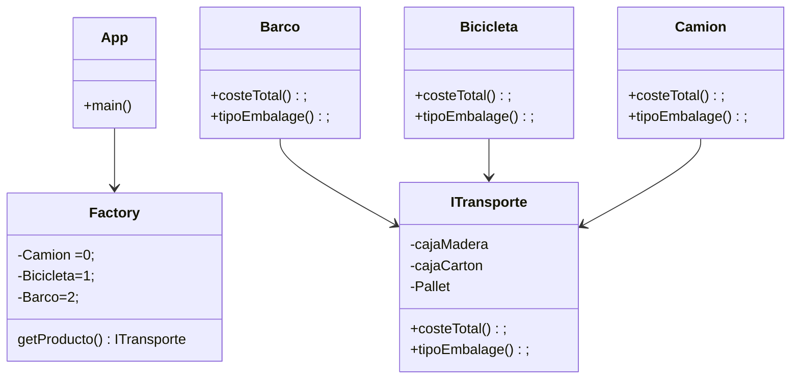

### FACTORY

Lo primero que hacemos es crear una nueva rama en git llamada barco
        
        git branch barco
        git checkout barco

Una vez creamos y estamos en la rama barco podemos empezar a trabajar

Creamos una nueva clase llamada **Barco** que implementa nuestra interfaz **ITransporte**

Ahora solo nos quedará modificar los métodos

**costeTotal**
**tipoEmbalage**

#### Coste total:

En mi caso sobreentiendo que los barcos se mueven entre paises por lo que los codigos postales serán mucho más amplios 
y en relacion a la competencia tendré que poner unos precios ajustados a esto.

OJO!!
---

Cabe mencionar que he creado una constante llamada Centro ciudad con el codigo postal de referencia del centro de la ciudad
donde tenemos la sede- En este caso vigo **36200**

#### tipoEmblage

En este caso también tengo en cuenta que en un barco se pueden cargar objetos mucho más pesados y amplios por lo que 
a la hora de añadir las medidas de los objetos o el peso he sido más permisivo

# DIAGRAMA DE CLASES

